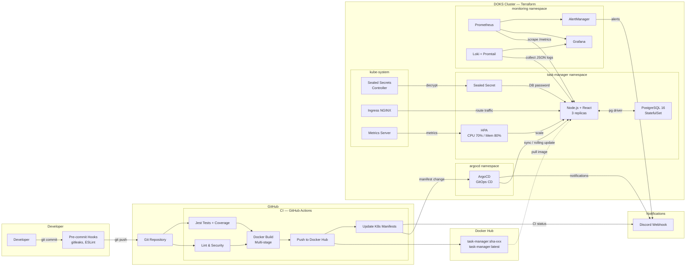

# DevOps Task Manager

A fullstack Task Manager web application demonstrating a **complete DevOps lifecycle** — from code commit to production deployment with full CI/CD, Infrastructure as Code, observability, and alerting.

**React** frontend + **Node.js/Express** backend, running on **DigitalOcean Kubernetes (DOKS)**, deployed via **ArgoCD GitOps**, monitored with **Prometheus + Grafana + Loki**.

---

## Screenshots

| React UI — Task Dashboard | Grafana — Monitoring Dashboard |
|:---:|:---:|
|  | Grafana: `http://<GRAFANA_IP>` |

---

## Architecture Diagram



---

## Tech Stack

| Technology | Version | Purpose |
|---|---|---|
| **Node.js** | 20 LTS | Backend runtime |
| **Express** | 4.19.2 | Web framework |
| **React** | 18.3.1 | Frontend UI |
| **Vite** | 5.4.2 | Frontend build tool |
| **PostgreSQL** | 16 | Relational database |
| **pg** | 8.11.5 | Node.js PostgreSQL driver |
| **prom-client** | 15.1.3 | Prometheus metrics for Node.js |
| **Docker** | 24+ | Multi-stage containerization |
| **Kubernetes (DOKS)** | 1.35+ | Container orchestration |
| **Terraform** | ≥ 1.7 | Infrastructure as Code |
| **ArgoCD** | 2.10+ | GitOps Continuous Deployment |
| **GitHub Actions** | v4 | CI Pipeline |
| **Prometheus** | 2.50+ | Metrics collection & alerting rules |
| **Grafana** | 10+ | Dashboards & visualization |
| **Loki** | 3.0+ | Log aggregation |
| **Sealed Secrets** | 0.26+ | Encrypted K8s secrets in Git |
| **ESLint** | 9.13+ | JavaScript/JSX linting |
| **Jest** | 29.7 | Unit testing + coverage |
| **pre-commit** | 3.6+ | Git hooks framework |
| **gitleaks** | 8.21+ | Secret scanning |

---

## Getting Started

### Prerequisites

- Docker & Docker Compose
- Node.js 20+
- `doctl` (DigitalOcean CLI)
- Terraform ≥ 1.7
- `kubectl`
- `kubeseal` (for Sealed Secrets)
- `pre-commit`

### Local Development (Docker Compose)

```bash
git clone https://github.com/To6enceto/devops-task-manager.git
cd devops-task-manager

# Start the app + PostgreSQL
docker-compose up --build

# App: http://localhost:8000        (React UI)
# API: http://localhost:8000/api/tasks
```

### Local Development (Node.js)

```bash
# Backend
cd backend
npm install
# Start PostgreSQL first (Docker):
docker run -d --name pg -e POSTGRES_PASSWORD=postgres -e POSTGRES_DB=taskmanager -p 5432:5432 postgres:16-alpine

export DATABASE_HOST=localhost DATABASE_PORT=5432 DATABASE_USER=postgres DATABASE_PASSWORD=postgres DATABASE_NAME=taskmanager
npm run dev   # Nodemon with hot-reload at http://localhost:8000

# Frontend (separate terminal)
cd frontend
npm install
npm run dev   # Vite dev server at http://localhost:5173 (proxies /api → :8000)

# Run tests
cd backend
npm test      # Jest, 11 tests, ~84% line coverage
```

### Deploy to DigitalOcean Kubernetes

```bash
# 1. Authenticate
doctl auth init

# 2. Configure Terraform
cd terraform
cp terraform.tfvars.example terraform.tfvars
# Edit terraform.tfvars with your DigitalOcean token

# 3. Deploy infrastructure
terraform init && terraform apply

# 4. Connect to the cluster
doctl kubernetes cluster kubeconfig save task-manager-cluster

# 5. Create sealed secret for the database password
kubectl create secret generic task-manager-db-secret \
  --namespace task-manager \
  --from-literal=DATABASE_PASSWORD=<secure-password> \
  --dry-run=client -o yaml | kubeseal --format yaml > k8s/base/sealed-secret.yaml

# 6. Apply ArgoCD Application (one-time)
kubectl apply -f argocd/application.yaml

# ArgoCD auto-syncs from Git — every push triggers the full pipeline
```

### Pre-commit Hooks

```bash
pip install pre-commit
pre-commit install

# Run all hooks manually
pre-commit run --all-files
```

### GitHub Secrets (Required for CI/CD)

| Secret | Description |
|---|---|
| `DOCKERHUB_USERNAME` | Docker Hub username |
| `DOCKERHUB_TOKEN` | Docker Hub access token |
| `DISCORD_WEBHOOK_URL` | Discord channel webhook URL |

---

## Project Structure

```
devops-task-manager/
├── backend/                        # Node.js/Express API
│   ├── index.js                    #   Server entrypoint, middleware, health endpoints
│   ├── db.js                       #   PostgreSQL pool (pg) + initDb()
│   ├── routes/
│   │   └── tasks.js                #   CRUD routes: GET/POST/PUT/DELETE /api/tasks
│   ├── tests/
│   │   └── tasks.test.js           #   Jest + Supertest (11 tests, 84% coverage)
│   └── package.json                #   Backend dependencies
├── frontend/                       # React (Vite) UI
│   ├── src/
│   │   ├── App.jsx                 #   Main app: task grid, filters, modals
│   │   ├── App.css                 #   Dark GitHub-themed styles
│   │   ├── main.jsx                #   React entry point
│   │   ├── index.css               #   Global CSS variables & reset
│   │   └── components/
│   │       ├── TaskCard.jsx        #   Task card (status badge, actions)
│   │       ├── TaskCard.css
│   │       ├── TaskForm.jsx        #   Create/edit form
│   │       └── TaskForm.css
│   ├── index.html                  #   HTML shell
│   ├── vite.config.js              #   Vite config (proxy, build to ../backend/public)
│   └── package.json                #   Frontend dependencies
├── terraform/                      # Infrastructure as Code (DOKS)
│   ├── main.tf                     #   Terraform settings & local backend
│   ├── provider.tf                 #   DigitalOcean provider
│   ├── variables.tf / outputs.tf   #   Input/output variables
│   ├── network.tf                  #   VPC
│   ├── doks.tf                     #   DOKS cluster & node pool
│   ├── helm-releases.tf            #   ArgoCD, Sealed Secrets, Ingress NGINX
│   ├── monitoring.tf               #   Prometheus stack & Loki
│   └── terraform.tfvars.example    #   Example values
├── k8s/                            # Kubernetes manifests (Kustomize)
│   ├── base/                       #   Base: namespace, configmap, sealed-secret,
│   │   │                           #   postgres-statefulset, deployment, service, ingress
│   │   └── kustomization.yaml
│   └── overlays/
│       ├── dev/                    #   1 replica, lower resources
│       └── prod/                   #   3 replicas, HPA enabled
├── argocd/                         # ArgoCD configuration
│   ├── application.yaml            #   ArgoCD Application resource
│   ├── notifications.yaml          #   Discord notification SealedSecret
│   └── helm-values.yaml            #   ArgoCD Helm values
├── monitoring/                     # Observability stack
│   ├── prometheus/
│   │   ├── values.yaml             #   kube-prometheus-stack Helm values
│   │   └── alerting-rules.yaml     #   Custom alerts (HighErrorRate, HighLatency, etc.)
│   ├── loki/values.yaml            #   Loki stack Helm values
│   └── grafana/dashboards/
│       └── task-manager-dashboard.json
├── docs/
│   └── architecture-diagram.png
├── .github/workflows/ci.yaml      # CI pipeline (lint → test → build → deploy → notify)
├── .pre-commit-config.yaml         # Pre-commit hooks (ESLint, gitleaks, yaml/json checks)
├── eslint.config.mjs               # ESLint 9 flat config (backend + frontend)
├── Dockerfile                      # Multi-stage: Vite build → Node.js runtime
├── docker-compose.yml              # Local dev (app + PostgreSQL)
├── package.json                    # Root ESLint dependencies
└── README.md
```

---

## CI/CD Pipeline

### CI — GitHub Actions (`.github/workflows/ci.yaml`)

Triggered on every push/PR to `main`:

| # | Job | What it does |
|---|---|---|
| 1 | **Lint & Security** | Runs pre-commit hooks: ESLint, gitleaks, YAML/JSON validation |
| 2 | **Test** | `npm test` — Jest with coverage threshold ≥ 70% |
| 3 | **Build & Push** | Multi-stage Docker build → pushes `sha-xxx` + `latest` to Docker Hub |
| 4 | **Update Manifests** | `sed` replaces image tag in `k8s/base/deployment.yaml`, commits & pushes |
| 5 | **Discord Notification** | Posts pipeline result (✅/❌) with commit SHA and run link |

### CD — ArgoCD (GitOps)

- Watches `k8s/overlays/prod/` in the Git repo
- When job 4 updates the image tag → ArgoCD detects drift → triggers rolling update
- Auto-sync with self-heal and pruning enabled
- Discord notifications on sync success/failure

---

## API Endpoints

| Method | Endpoint | Description |
|---|---|---|
| GET | `/` | React UI (Single Page App) |
| GET | `/api/info` | App name, version |
| GET | `/health` | Liveness probe |
| GET | `/ready` | Readiness probe (DB ping) |
| GET | `/metrics` | Prometheus metrics |
| GET | `/api/tasks` | List all tasks |
| GET | `/api/tasks/:id` | Get task by ID |
| POST | `/api/tasks` | Create a task |
| PUT | `/api/tasks/:id` | Update a task |
| DELETE | `/api/tasks/:id` | Delete a task |

---

## Observability

- **Metrics**: Prometheus scrapes `/metrics` — HTTP request count, latency histogram, error rate
- **Logs**: Loki + Promtail collects structured JSON logs from all pods
- **Dashboards**: Grafana with pre-configured Task Manager dashboard (RED metrics, resource usage, logs)
- **Alerting**: 4 custom PrometheusRule alerts → AlertManager → Discord
  - `TaskManagerHighErrorRate` (>5% 5xx in 5m)
  - `TaskManagerHighLatency` (p95 > 1s in 5m)
  - `TaskManagerPodCrashLooping` (>3 restarts in 15m)
  - `TaskManagerPodNotReady` (not ready for 5m)

---

## Secrets Management

| Layer | What | How |
|---|---|---|
| **GitHub Secrets** | Docker Hub token, Discord webhook | `${{ secrets.X }}` in CI |
| **Sealed Secrets** | DB password, ArgoCD notifications | Encrypted YAML in Git, decrypted by controller |
| **ConfigMap** | Non-sensitive config (DB host, port, NODE_ENV) | Plain YAML in Git |
| **gitleaks** | Pre-commit scan | Blocks hardcoded secrets from entering Git |
