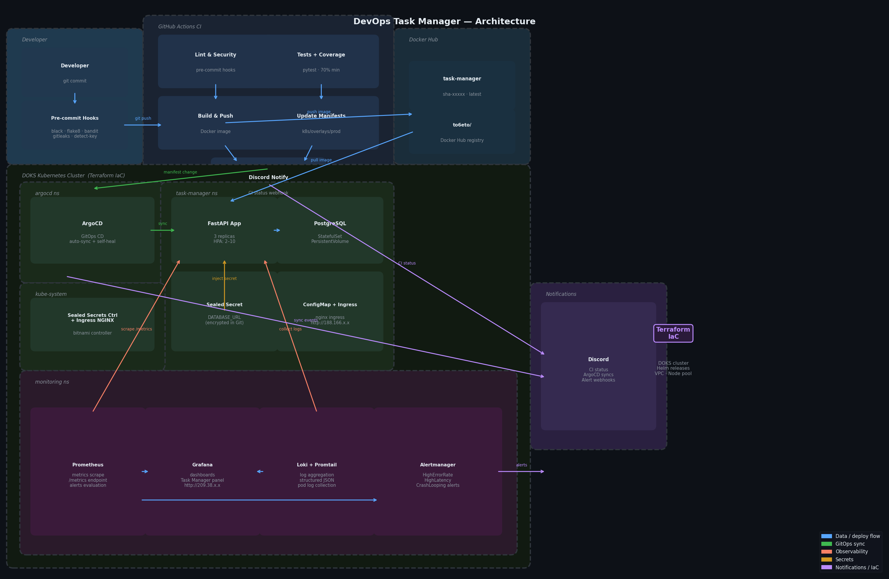
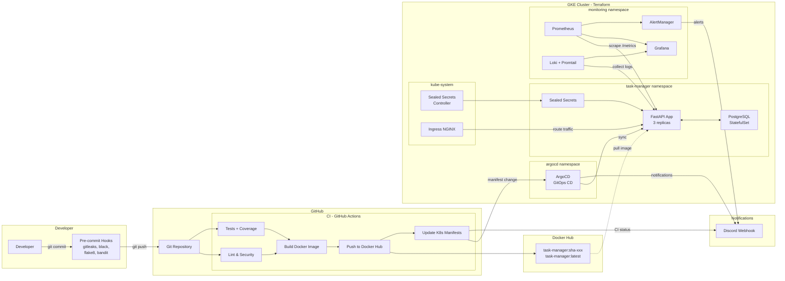

# DevOps Task Manager

A CRUD Task Manager web application demonstrating a **complete DevOps lifecycle** — from code commit to production deployment with full CI/CD, Infrastructure as Code, observability, and alerting.

## Architecture Diagram





## Getting Started

### Prerequisites

- Docker & Docker Compose
- Python 3.12+
- `doctl` (DigitalOcean CLI)
- Terraform >= 1.7
- `kubectl`
- `kubeseal` CLI (for Sealed Secrets)
- `pre-commit`

### Local Development (Docker Compose)

```bash
# Clone the repository
git clone https://github.com/<YOUR_USERNAME>/devops-task-manager.git
cd devops-task-manager

# Start the application
docker-compose up --build

# App is available at http://localhost:8000
# API docs at http://localhost:8000/docs
```

### Local Development (Python)

```bash
# Create virtual environment
python -m venv .venv
source .venv/bin/activate

# Install dependencies
pip install -r app/requirements.txt -r app/requirements-dev.txt

# Start PostgreSQL (via Docker)
docker run -d --name pg -e POSTGRES_PASSWORD=postgres -e POSTGRES_DB=taskmanager -p 5432:5432 postgres:16-alpine

# Run the app
uvicorn app.main:app --reload

# Run tests
pytest app/tests/ -v
```

### Deploy to DigitalOcean Kubernetes (Production)

```bash
# 1. Install doctl and authenticate
doctl auth init  # paste your DigitalOcean API token

# 2. Configure Terraform
cd terraform
cp terraform.tfvars.example terraform.tfvars
# Edit terraform.tfvars — paste your DigitalOcean API token

# 3. Deploy infrastructure
terraform init
terraform plan
terraform apply

# 5. Configure kubectl
doctl kubernetes cluster kubeconfig save task-manager-cluster

# 6. Create sealed secret for database
kubectl create secret generic task-manager-db-secret \
  --namespace task-manager \
  --from-literal=DATABASE_PASSWORD=<your-secure-password> \
  --dry-run=client -o yaml | kubeseal --format yaml > k8s/base/sealed-secret.yaml

# 7. Apply ArgoCD Application (one-time)
kubectl apply -f argocd/application.yaml

# ArgoCD will automatically sync and deploy the app
```

### Setting up Pre-commit Hooks

```bash
pip install pre-commit
pre-commit install

# Run against all files manually
pre-commit run --all-files
```

### GitHub Secrets (Required for CI/CD)

Configure these secrets in your GitHub repository settings:

| Secret                | Description                                      |
|-----------------------|--------------------------------------------------|
| `DOCKERHUB_USERNAME`  | Docker Hub username                              |
| `DOCKERHUB_TOKEN`     | Docker Hub access token                          |
| `DISCORD_WEBHOOK_URL` | Discord channel webhook URL                      |
| `DIGITALOCEAN_TOKEN`  | DigitalOcean API token (used for future CD steps)|

## Technologies & Versions

| Technology            | Version   | Purpose                        |
|-----------------------|-----------|--------------------------------|
| Python                | 3.12+     | Application runtime            |
| FastAPI               | 0.115.6   | Web framework (async)          |
| PostgreSQL            | 16        | Database                       |
| SQLAlchemy            | 2.0.36    | ORM (async)                    |
| Docker                | 24+       | Containerization               |
| Kubernetes (DOKS)     | 1.35+     | Container orchestration        |
| Terraform             | >= 1.7    | Infrastructure as Code (DOKS)  |
| ArgoCD                | 2.10+     | GitOps Continuous Deployment   |
| GitHub Actions        | v4        | CI Pipeline                    |
| Prometheus            | 2.50+     | Metrics collection             |
| Grafana               | 10+       | Dashboards & visualization     |
| Loki                  | 3.0+      | Log aggregation                |
| Sealed Secrets        | 0.26+     | Kubernetes secrets in Git      |
| pre-commit            | 3.6+      | Git hooks framework            |
| gitleaks              | 8.21+     | Secret scanning                |

## Project Structure

```
devops-task-manager/
├── app/                           # FastAPI application
│   ├── main.py                    #   App entrypoint, health checks, metrics
│   ├── config.py                  #   Application settings (env vars)
│   ├── database.py                #   SQLAlchemy async engine & session
│   ├── models.py                  #   Database models (Task)
│   ├── schemas.py                 #   Pydantic request/response schemas
│   ├── routers/
│   │   └── tasks.py               #   CRUD endpoints for tasks
│   ├── tests/
│   │   ├── conftest.py            #   Test fixtures & DB setup
│   │   └── test_tasks.py          #   Unit tests for all endpoints
│   ├── requirements.txt           #   Production dependencies
│   └── requirements-dev.txt       #   Development/test dependencies
├── terraform/                     # Infrastructure as Code (DOKS)
│   ├── main.tf                    #   Terraform settings & local backend
│   ├── provider.tf                #   DigitalOcean provider
│   ├── variables.tf               #   Input variables
│   ├── outputs.tf                 #   Output values
│   ├── network.tf                 #   VPC & subnet
│   ├── doks.tf                    #   DOKS cluster & node pool
│   ├── helm-releases.tf           #   ArgoCD, Sealed Secrets, Ingress NGINX
│   ├── monitoring.tf              #   Prometheus stack & Loki (Helm releases)
│   └── terraform.tfvars.example   #   Example variable values (do_token, region, node_size)
├── k8s/                           # Kubernetes manifests (Kustomize)
│   ├── base/                      #   Base manifests
│   │   ├── namespace.yaml
│   │   ├── configmap.yaml
│   │   ├── sealed-secret.yaml
│   │   ├── postgres-statefulset.yaml
│   │   ├── deployment.yaml
│   │   ├── service.yaml
│   │   ├── ingress.yaml
│   │   └── kustomization.yaml
│   └── overlays/
│       ├── dev/                   #   Dev overrides (1 replica, low resources)
│       └── prod/                  #   Prod overrides (3 replicas, high resources)
├── argocd/                        # ArgoCD configuration
│   ├── application.yaml           #   ArgoCD Application resource
│   ├── notifications.yaml         #   Discord notification config
│   └── helm-values.yaml           #   ArgoCD Helm values reference
├── monitoring/                    # Observability stack
│   ├── prometheus/
│   │   ├── values.yaml            #   kube-prometheus-stack Helm values
│   │   └── alerting-rules.yaml    #   Custom PrometheusRule alerts
│   ├── loki/
│   │   └── values.yaml            #   Loki stack Helm values
│   └── grafana/
│       └── dashboards/
│           └── task-manager-dashboard.json
├── .github/
│   └── workflows/
│       └── ci.yaml                # CI pipeline (lint, test, build, deploy, notify)
├── docs/
│   └── architecture-diagram.png   # Architecture diagram
├── .pre-commit-config.yaml        # Pre-commit hooks configuration
├── .gitleaks.toml                 # Gitleaks secret scanning config
├── .gitignore
├── Dockerfile                     # Multi-stage Docker build
├── docker-compose.yml             # Local development setup
├── pyproject.toml                 # Python project config (pytest)
└── README.md                      # This file
```

## CI/CD Pipeline

### CI (GitHub Actions)

Triggered on every push/PR to `main`:

1. **Lint & Security** — pre-commit hooks (formatting, linting, secret scanning)
2. **Test** — pytest with coverage (minimum 70%)
3. **Build & Push** — Docker image built and pushed to Docker Hub
4. **Update Manifests** — Image tag updated in K8s manifests (triggers ArgoCD)
5. **Discord Notification** — Pipeline status sent to Discord

### CD (ArgoCD)

- Watches the `k8s/overlays/prod/` directory for changes
- Automated sync with self-heal and pruning
- Discord notifications on sync success/failure

## Observability

- **Metrics**: Prometheus scrapes `/metrics` endpoint (HTTP request rate, latency, error rate)
- **Logs**: Loki + Promtail collects structured JSON logs from all pods
- **Dashboards**: Grafana with pre-configured Task Manager dashboard (RED metrics, resource usage, logs)
- **Alerting**: AlertManager sends alerts to Discord (HighErrorRate, HighLatency, PodCrashLooping, PodNotReady)

## Secrets Management

- **CI/CD secrets**: GitHub Secrets (Docker Hub token, Discord webhook, DigitalOcean token)
- **Kubernetes secrets**: Bitnami Sealed Secrets (encrypted in Git, decrypted in cluster)
- **No plaintext secrets in the repository** — enforced by gitleaks pre-commit hook

## API Endpoints

| Method | Endpoint        | Description              |
|--------|-----------------|--------------------------|
| GET    | `/`             | App info                 |
| GET    | `/health`       | Liveness probe           |
| GET    | `/ready`        | Readiness probe          |
| GET    | `/metrics`      | Prometheus metrics       |
| GET    | `/docs`         | OpenAPI documentation    |
| GET    | `/tasks/`       | List all tasks           |
| GET    | `/tasks/{id}`   | Get task by ID           |
| POST   | `/tasks/`       | Create a new task        |
| PUT    | `/tasks/{id}`   | Update a task            |
| DELETE | `/tasks/{id}`   | Delete a task            |
